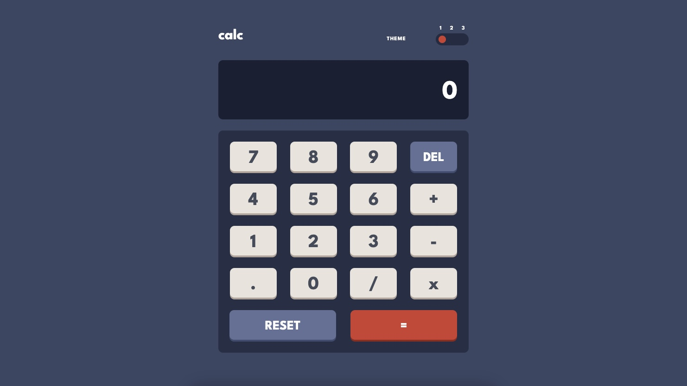
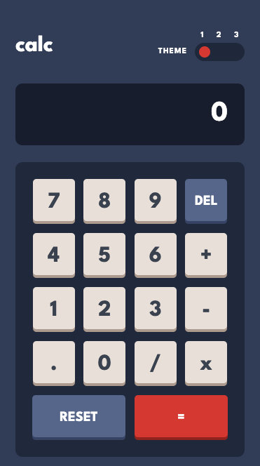
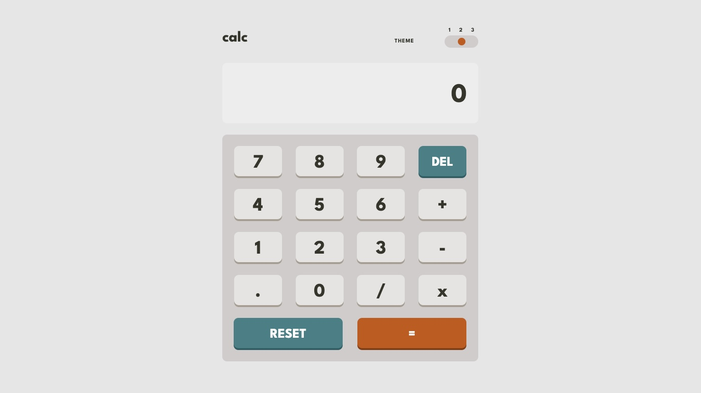
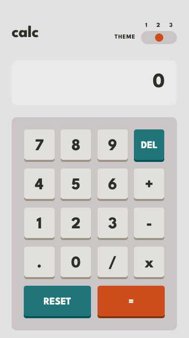
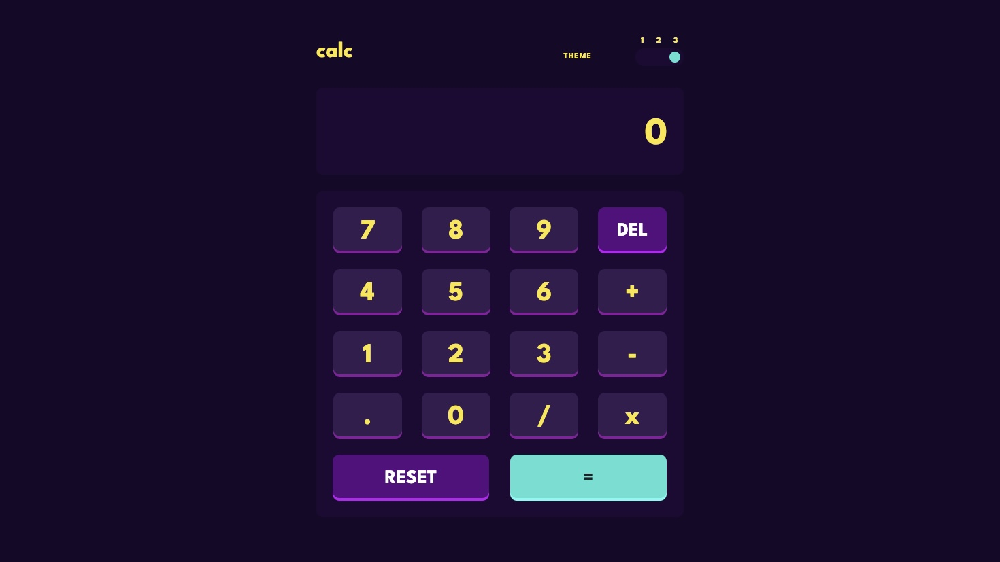
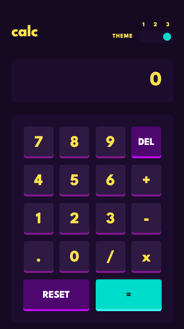

Modified by Kashif
# Frontend Mentor - Calculator app solution

This is a solution to the [Calculator app challenge on Frontend Mentor](https://www.frontendmentor.io/challenges/calculator-app-9lteq5N29). Frontend Mentor challenges help you improve your coding skills by building realistic projects. 

The calculator app is a web-based calculator designed with a modern and aesthetic interface. It provides standard arithmetic operations, including addition, subtraction, multiplication, and division. The calculator features a dynamic theme switcher, allowing users to choose from three visually distinct themes. The user interface is responsive and adapts seamlessly to different screen sizes.

## Table of contents

- [Overview](#overview)
  - [The challenge](#the-challenge)
  - [Screenshots](#screenshots)
  - [Links](#links)
- [My process](#my-process)
  - [Built with](#built-with)
- [Author](#author)

## Overview

### The challenge

Users should be able to:

- See the size of the elements adjust based on their device's screen size.
- Perform mathematical operations like addition, subtraction, multiplication, and division.
- Adjust the color theme based on their preference.

### Screenshots
#### Theme 1 - Desktop

#### Theme 1 - Mobile

#### Theme 2 - Desktop

#### Theme 2 - Mobile

#### Theme 3 - Desktop

#### Theme 3 - Mobile

### Links

- Solution URL: [Click here!](https://your-solution-url.com)
- Live Site URL: [Click here!](https://your-live-site-url.com)

## My process

### Built with

- Semantic HTML5 markup
- CSS Modules
- CSS variables
- CSS Flexbox and Grid
- CSS Transitions
- Mobile-first workflow
- Responsive Design
- [React](https://reactjs.org/) - JS library
- React Hooks (useState, useEffect)
- React Props
- [Math.js](https://www.npmjs.com/package/mathjs) - Math library

## Author

- Website - [Tulio Minini](https://tuliominini.com/)
- Frontend Mentor - [@t-minini](https://www.frontendmentor.io/profile/t-minini)
- LinkedIn - [LinkedIn](https://www.linkedin.com/in/tulio-minini/)
- Github - [Github](https://github.com/t-minini)
